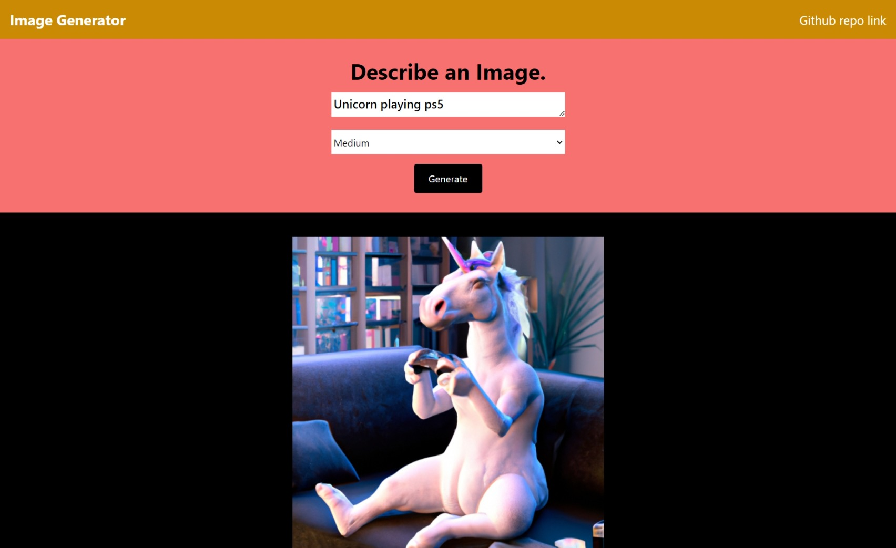
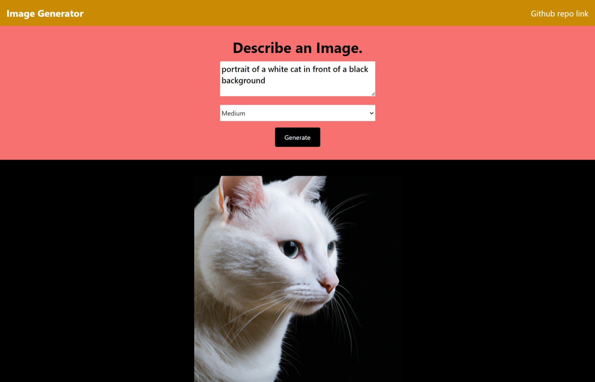

# OpenAI Image Generator
This is a simple image generator built with Node.js and Express that uses [OpenAI's Dall-E](https://beta.openai.com/docs/guides/images) models to generate images.

## Screenshots:




## Technologies used:-
```
   1. React
   2. Express
   3. Node.js
   4. OpenAI API
```

## How to use:-

Rename the example.env file to .env.

Generate an API KEY at [OpenAI](https://beta.openai.com/) and add it to the .env file.

Install the dependencies:-

```
npm install
```

Run frontend:-
```
npm run dev
```

Run Server:-
```
npm start
```
